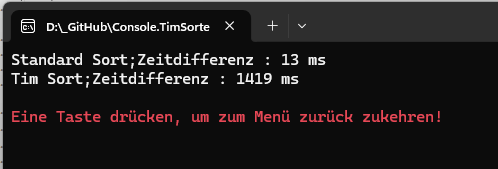

# C# Implementierung des TIM Sorter Algorithmus


]

## Implementierung und Beispiel

Timsort ist ein hochperformanter, hybrider Sortieralgorithmus (eine Kombination aus Merge Sort und Insertion Sort), der in vielen modernen Programmiersprachen (wie Java, Python, Rust, Swift usw.) und Laufzeitumgebungen als Standard-Sortieralgorithmus eingesetzt wird.

### Definition
TimSort ist ein hybrider, stabiler Sortieralgorithmus, der Merge-Sort und Binary Insertion-Sort kombiniert, um optimale Effizienz zu erreichen. Er wurde entwickelt, um schnell sortierte Laufwerke zu erkennen und diese effizient zu sortieren, wobei er idealerweise die Gesamtanzahl von Vergleichen und Vertauschungen minimiert.

### Performance

Der Standard-Sortieralgorithmus in C# (.NET) ist keine einfache Implementierung eines einzelnen Algorithmus, sondern eine hybride Lösung.



Im Vergleich zum NET Standard Sorter, der auf Introsort basiert, bietet Timsort eine vergleichsweise schlechte Leistung. Seine Stärke kann der Tim Sort bei vor sortieren Daten z,B. für reale Daten, die oft "fast sortiert" sind (z.B. Sortieren einer sortierten Liste, zu der neue Elemente hinzugefügt wurden)

**Introsort (Introspective Sort):** Dies ist der Hauptalgorithmus, der von Array.Sort() und List<T>.Sort() verwendet wird. Introsort beginnt mit Quicksort und wechselt zu Heapsort, wenn die Rekursionstiefe einen bestimmten Schwellenwert überschreitet, um eine schlechtere Zeitkomplexität als **O(nlog n)** zu vermeiden.

**Nicht stabil:** Die Standard-Sortiermethode (Sort()) ist in .NET nicht stabil, was bedeutet, dass die relative Reihenfolge von Elementen mit gleichen Werten nicht garantiert beibehalten wird.\
**LINQ (OrderBy):** Im Gegensatz dazu ist LINQs OrderBy ein stabiler Sortieralgorithmus. 


## Beispielsource

der Source ist soll auch einfache Art und Weise die Funktionen eines Features zeigen. Der Source ist so geschrieben, das so wenig wie möglich zusätzliche NuGet-Pakete benötigt werden.
```csharp
Console.Clear();

List<int> data = GenerateListOfInt(10, 1, 20);

CMenu.Print(string.Join(", ", data));

TimSorter.Sort(data);

CMenu.Print(string.Join(", ", data));

CMenu.Wait();
```

Sortierung mit einem benutzerdefinierter Klasse.
```csharp
Console.Clear();

List<Person> people = new()
{
    new Person { Name = "Anna", Age = 32 },
    new Person { Name = "Tom", Age = 21 },
    new Person { Name = "Julia", Age = 45 }
};

TimSorter.Sort(people, new PersonAgeComparer());

foreach (var person in people)
{
    CMenu.Print($"{person.Name} ({person.Age} Jahre)");
}

CMenu.Print(new string('-',40), ConsoleColor.Green);
SortHelper.TimSort(people, (a, b) => a.Age.CompareTo(b.Age), SortDirection.Descending);
foreach (var person in people)
{
    CMenu.Print($"{person.Name} ({person.Age} Jahre)");
}

CMenu.Wait();
```

